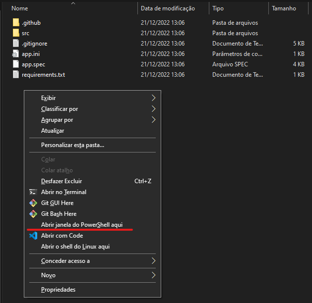

# :gear: Automação p/ Extração de Informações da Planilha de Healtcheck de Backup

> Script feito com o intuito de automatizar a tarefa de extração de informações de uma planilha padronizada e gerar uma mensagem no formato específico com as informações da planilha de backup.

## :envelope_with_arrow: Exemplo Mensagem Final

<details>
  <summary> Exemplo Mensagem </summary>

  ```plain
  🩺 Health-Check Backup
  🗓️ 02/01/2023

  🔷 Infraestrutura
  (AVAMAR E VEEAM)

  RJ1
    ✅ Área Ocupada: 69%
    ℹ️ Área Livre: 51.5 TB
    ℹ️ Redução nas últimas 24h: -0.7 TB

  RJ2
   ⚠️ Área Ocupada: 83%
    ℹ️ Área Livre: 29.2 TB
    ℹ️ Crescimento nas últimas 24h: 4.08 TB

  🔷 Replicação AWS
    ✅ RJ1 Executado: 100%
    ℹ️ Dt última: 02/01/2023
    ⚠️ Área Livre: 15%

    ✅ RJ2 executado: 100%
    ℹ️ Dt última: 02/01/2023
    ❌ Área Livre: 9%, processo de Cleaning em execução.

  🔷 Execuções Data Center
    ℹ️ JOBS RJ1: 4163
    ✅ Executado: 99.95%

    ℹ️ JOBS RJ2: 3050
    ✅ Executado: 99.90%

  🔷 Execuções Unidades
    ✅ Escopo: 77 Locais
    ℹ️ Sucesso: 98.00%

    ❌ XPTO, último backup: 31/12/2022
  ```

</details>

## :receipt: Thresholds Para Formatação Condicional

- [ ] Infraestrutura Área Ocupada (Case 1)

  ```plain
  ✅ VERDE: Ocupação até 79% da área
  ⚠️ AMARELO: Ocupação entre 80% e 89%
  ❌ VERMELHO: Ocupação acima de 90%
  ```

- [ ] Replicação AWS % Executado (Case 2)

  ```plain
  ✅ VERDE: Valor acima de 90%
  ⚠️ AMARELO: Valor entre 81% e 90%
  ❌ VERMELHO: Valor até 80% da área
  ```

- [ ] Replicação AWS % Área Livre (Case 3)

  ```plain
  ✅ VERDE: Área maior ou igual a 20%
  ⚠️ AMARELO: Área disponível entre 19% e 11%
  ❌ VERMELHO: Área disponível igual ou menor a 10%
  ```
  
- [ ] % Executado de JOBS DATA CENTER (Case 4)

  ```plain
  ✅ VERDE: Execução com sucesso igual ou maior a 99%
  ⚠️ AMARELO: Execução com sucesso entre 95% e 98.99%
  ❌ VERMELHO: Execução com sucesso menor que 95%
  ```

  🔹 Execuções Unidades
    ⚠️ Escopo: 77 Locais
    :information_source: Sucesso: 98,70%
    ❌ Hospital Yutaka Takeda, último backup: 24/12/2022

- [ ] Unidades Escopo (Case 5)

  ```plain
  ✅ VERDE - Quando todas as unidades estiverem com sucesso
  ⚠️ AMARELO - Quando possuir 1 ou mais status parcial
  ❌ VERMELHO - Quando possuir 1 ou mais status com falha
  ```

- [ ] Status Unidades

  ```plain
  Quando as unidades apresentarem os status "Sucesso" ou "Sucesso e Sem backup no dia"

  🔷 Execuções Unidades
    ✅ Escopo: 77 Locais
    ℹ️ Sucesso: 100.00%

  Quando as unidades apresentarem os status "Sucesso - Parcial - Sem backup no dia"

  🔷 Execuções Unidades
    ⚠️ Escopo: 77 Locais
    ℹ️ Sucesso: 100.00%

  Quando uma ou mais unidade apresentarem o status "Sem informação"

  🔷 Execuções Unidades
    ⚠️ Escopo: 77 Locais
    ℹ️ Sucesso: 98.00%
      ⚠️Hospital Santa Marina, último backup conhecido: 01/01/2023

  Quando uma ou mais unidade apresentarem o status "Falha"

  🔷 Execuções Unidades
    ❌ Escopo: 77 Locais
    ℹ️ Sucesso: 98.00%
      ❌Hospital Santa Marina, último backup: 01/01/2023
  ```

- [ ] Cálculo Percentual Execuções Unidades

  - Os possíveis status na planilha são: `Sucesso`, `Parcial`, `Sem Backup no Dia`, `Sem Informação`, `Em Construção` e `Falha`.
  
  - Os status usados para contagem do total de unidades são: `Sucesso`, `Parcial`, `Sem Backup no Dia`, `Sem Informação` e `Falha`.

  - Os status considerados :white_check_mark: Sucesso são: `Sucesso`, `Parcial` e `Sem Backup no Dia`.
  
  - Os status considerados :x: Falha são: `Sem Informação` e `Falha`.

  - Para realizar o cálculo do percentual: `percentual_sucesso = (qtd_sucesso / qtd_total_unidades) * 100`

## :woman_technologist: Como Executar o Script

### Pré-Requisitos

  Este script foi desenvolvido em Python e foi testado com a versão 3.10. Você pode encontrar todas as versões do Python para **Windows** no [site oficial](https://www.python.org/downloads/windows/).

  1. Após ter o Python instalado, faça o [Download](https://github.com/RaulDelary/pipitchi/archive/refs/heads/main.zip) desse repositório com o código fonte do script.
  2. Extraia o arquivo ZIP em uma pasta de sua preferência (botão direito -> extrair tudo).
  3. Abra a pasta do projeto `pipitchi-main`.
  4. Em um espaço vazio, segure a tecla `shift` e clique com o `botão-direito` do mouse e clique na opção `Abrir janela do PowerShell aqui`.
  
  5. Com a janela do Powershell aberta, iremos instalar as dependências necessárias para o scritp usando o comando `pip install -r .\requirements.txt`. Aguarde até que o Download das dependências seja realizado.

### Executando o Script

#### CLI

  1. Para executar a versão de linha de comando do script: `python .\src\cli.py <caminho_da_planilha>`. Exemplo com caminho da planilha: ``

  2. O programa produzirá a saída da messangem no terminal que poderá ser copiada com o botão direito e colada no WhatsApp. Os quadrados que aparecem no terminal serão interpretados corretamente como os emojis quando colado no WhatsApp.

#### Interface Gráfica

  1. Para executar a interface gráfica do programa: `python .\src\app.py`.
  2. O programa abrirá sua interface gráfica para que possa ser selecionada a planilha e executar a extração dos dados para gerar a mensagem.

  Caso não queria seguir o passo a passo de baixar o repositório e usar o Python para executar o script, também é possível baixar o executável já compilado desse na pagina de [Releases](https://github.com/rauldelary/pipitchi/releases) (arquivo .zip contendo o módulo CLI e módulo interface gráfica).

### Compilando o Script

  Para compilar o programa e gerar um único executável, utilizaremos o pacote `PyInstaller` (já instalado anteriormente no passo de pré-requisitos) que agrupará todas as dependências de biblioteca em único arquivo executável.

  Ainda na pasta do projeto, utilize o comando `pyinstaller.exe --noconfirm --clean .\app.spec`. Será criada uma nova pasta `dist` e dentro dela uma pasta `bin` que conterá o arquivo `app_standalone.exe` que poderá ser executado com duplo clique.
